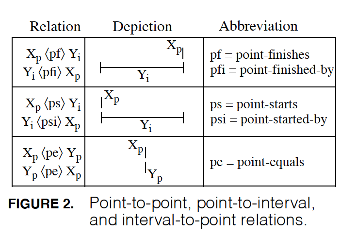

# Qualitative Reasoning (qualreas)

## Summary

**qualreas** is a Python module that implements *Relation Algebras* for performing *Qualitative Reasoning (QR)*.
The primary type of relation algebras derived and hosted here are for temporal and spatial reasoning, however,
the software framework here is general purpose, so other relation algebra domains are possible.

The four temporal algebras found in ["Intervals, Points, and Branching Time"(Reich, 1994)](https://www.researchgate.net/publication/220810644_Intervals_Points_and_Branching_Time) are included here.
(A scanned copy of the paper can also be found [here](http://www.google.com/url?sa=t&rct=j&q=&esrc=s&source=web&cd=1&cad=rja&uact=8&ved=0CCMQFjAA&url=http%3A%2F%2Fwww2.cs.uregina.ca%2F~temporal%2Ftime94%2Freich.pdf&ei=XeieVLnkFsX9yQSBi4G4Cw&usg=AFQjCNG8EUtVBz_5OFJXFbMJVtHGjj6b7w&sig2=RrmzWe5WcwCet7fr2AuLNg&bvm=bv.82001339,d.aWw).)  The [Region Connection Calculus (RCC8)](http://en.wikipedia.org/wiki/Region_connection_calculus) is also included.

## To Be Done

* Create a JSON &/or RDF interface for asserting constraints
* Update and test the csv2json.py code to Python 3
* Update the names of the CSV files to match those of their JSON counterparts
* Update timeX.ttl ontology to fix W3C reference & add branching time relations
* Change the name "Point" to "Instant" (to match https://www.w3.org/TR/owl-time/)
* Change the references in Algebras to "multiplication" & "compose" to "composition" & "comp".
* Create Sphinx docs
* Update this Readme
* Create functionality for Algebra generation
  * Generation of algebra elements
  * Generation of algebra composition tables
* Rectangle Algebra
  * Complete point relation composition table
  * Generate elements (approx 125)
  * Generate composition table
* Generate all 4 temporal algebras and check them against the existing ones
* Generate an RCC8 variant that permits a region to have a single hole
* Add additional algebras: Matuzak (sp?), Anger's right-branching algebra, etc.
* Compare the additional algebras to those that I generated
* See if I can make contraint propagation more efficient by not propagating
constraints for temporal entities "contained" by other temporal entitites.

## Allen's Algebra of Proper Time Intervals

## Resources

* [\"Maintaining Knowledge about Temporal Intervals\" by James F. Allen](https://cse.unl.edu/~choueiry/Documents/Allen-CACM1983.pdf) - Allen's original paper (PDF)
* [Allen's Interval Algebra](https://www.ics.uci.edu/~alspaugh/cls/shr/allen.html) or [here](https://thomasalspaugh.org/pub/fnd/allen.html) - summarizes Allen's algebra of proper time intervals
* [\"Intervals, Points, and Branching Time\" by A.J. Reich](https://www.researchgate.net/publication/220810644_Intervals_Points_and_Branching_Time) - basis for the extensions here to Allen's algebra
* [W3C Time Ontology in OWL](https://www.w3.org/TR/owl-time/) - temporal vocabulary used here is based on the W3C vocabulary of time
* [bitsets Python package](https://bitsets.readthedocs.io/en/stable/) - used to implement Algebra relation sets and operations
* [NetworkX Python package](http://networkx.github.io/) - used to represent directed graph of constraints
* [Python format string syntax](https://docs.python.org/3/library/string.html#format-string-syntax) - used in Algebra summary method
* [Spatial Ontology](https://www.w3.org/2017/sdwig/bp/) - I'm still looking for a standard spatial vocabulary; maybe start here
* [Qualitative Spatial Relations (QSR) Library](https://qsrlib.readthedocs.io/en/latest/index.html) - an alternative library to the one defined here
* [Papers on Qualitative Reasoning](http://www.cs.utexas.edu/users/qr/papers-QR.html#Basic) - a list by Benjamin Kuipers

## What is this repository for? ###

* Quick summary
* Version 0.1
* [Learn Markdown](https://bitbucket.org/tutorials/markdowndemo)

## How do I get set up? ###

* Summary of set up
* Configuration
* Dependencies
* How to run tests
* Deployment instructions

## Contribution guidelines ###

* Writing tests
* Code review
* Other guidelines

## Who do I talk to? ###

* Repo owner/admin: Alfred J. Reich (al.reich@gmail.com)
* There are no other community or team contacts at this time
