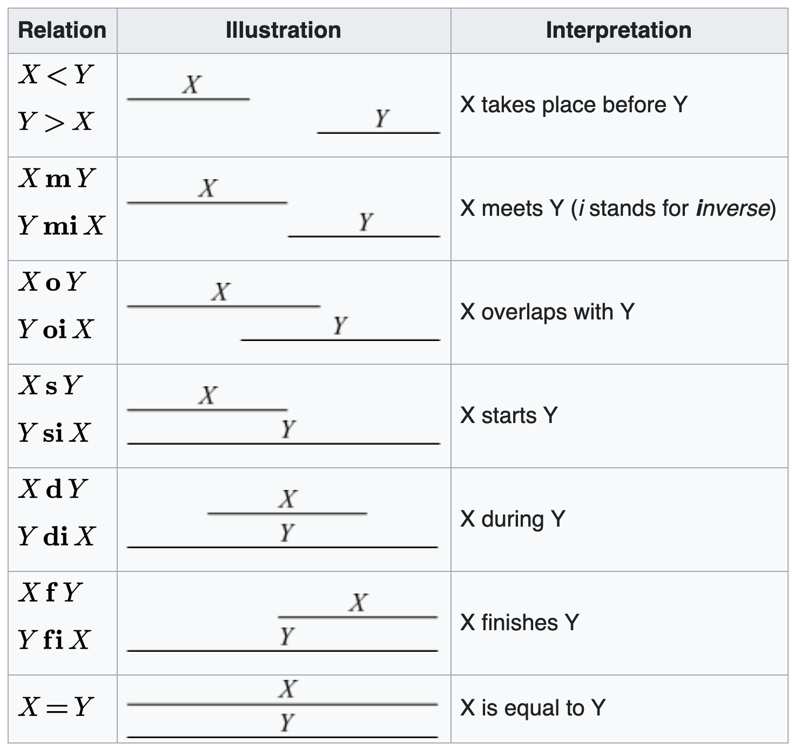

Allen’s Algebra of Proper Time Intervals
========================================

“Allen’s interval algebra is a calculus for temporal reasoning that was
introduced by James F. Allen in 1983. The calculus defines possible
relations between time intervals and provides a composition table that
can be used as a basis for reasoning about temporal descriptions of
events.” –
`Wikipedia <https://en.wikipedia.org/wiki/Allen%27s_interval_algebra>`__

Allen’s algebra is based on the 13 possible ways that proper time
intervals can be related to each other, as shown in the following
`figure from
Wikipedia <https://en.wikipedia.org/wiki/Allen%27s_interval_algebra#Relations>`__

NOTE: Several of the relation symbols in qualreas differ from those in
the Wikipedia figure, below: B instead of <, A instead of >, and E
instead of =

.. code:: ipython3

    from IPython.display import Image
    
    Image(filename='../docs/_static/Allens_Interval_Relations.png', width="400") 

References
----------

1. `“Maintaining Knowledge about Temporal Intervals” by James F.
   Allen <https://cse.unl.edu/~choueiry/Documents/Allen-CACM1983.pdf>`__
   - Allen’s original paper (PDF)
2. `Allen’s Interval
   Algebra <https://www.ics.uci.edu/~alspaugh/cls/shr/allen.html>`__ or
   `here <https://thomasalspaugh.org/pub/fnd/allen.html>`__ - summarizes
   Allen’s algebra of proper time intervals
3. `“Intervals, Points, and Branching Time” by A.J.
   Reich <https://www.researchgate.net/publication/220810644_Intervals_Points_and_Branching_Time>`__
   - basis for the extensions to Allen’s algebra

Dependencies
------------

.. code:: ipython3

    import qualreas as qr
    import os

.. code:: ipython3

    path = os.path.join(os.getenv('PYPROJ'), 'qualreas')

Instantiate an Algebra
----------------------

Algebras are defined in JSON format. The definition of Allen’s algebra
of proper time intervals, published in 1983, is a “Linear Interval
Algebra” and is instantiated as follows:

.. code:: ipython3

    alg = qr.Algebra(os.path.join(path, "Algebras/Linear_Interval_Algebra.json"))

Algebra Summary
---------------

Two important aspects of an algebra are defined in the JSON file that
was loaded above: 1. The algebra’s set of relations and their properties
1. The algebra’s composition or transitivity table (called TransTable in
the JSON file)

The first of these aspects, the set of relations, is described by the
Algebra’s summary method, as shown below.

Composition/Transitivity tables are used to implement the Algebra’s
compose method, and are generally too large to print out. (Note:
Composition is often referred to as “multiplication”.)

.. code:: ipython3

    alg.summary()

.. parsed-literal::

      Algebra Name: Linear_Interval_Algebra
       Description: Allen's algebra of proper time intervals
     Equality Rels: E
         Relations:
                NAME (SYMBOL)         CONVERSE (ABBREV)  REFLEXIVE  SYMMETRIC TRANSITIVE   DOMAIN        RANGE
                 Before (  B)               After ( BI)    False      False       True       PInt          PInt
                  After ( BI)              Before (  B)    False      False       True       PInt          PInt
                 During (  D)            Contains ( DI)    False      False       True       PInt          PInt
               Contains ( DI)              During (  D)    False      False       True       PInt          PInt
                 Equals (  E)              Equals (  E)     True       True       True       PInt          PInt
               Finishes (  F)         Finished-by ( FI)    False      False       True       PInt          PInt
            Finished-by ( FI)            Finishes (  F)    False      False       True       PInt          PInt
                  Meets (  M)              Met-By ( MI)    False      False      False       PInt          PInt
                 Met-By ( MI)               Meets (  M)    False      False      False       PInt          PInt
               Overlaps (  O)       Overlapped-By ( OI)    False      False      False       PInt          PInt
          Overlapped-By ( OI)            Overlaps (  O)    False      False      False       PInt          PInt
                 Starts (  S)          Started-By ( SI)    False      False       True       PInt          PInt
             Started-By ( SI)              Starts (  S)    False      False       True       PInt          PInt
    
    Domain & Range Abbreviations:
       Pt = Point
     PInt = Proper Interval

Algebra Element Summary
-----------------------

Here are a few random individual element summaries:

.. code:: ipython3

    from random import sample
    
    sample_size = 3
    
    for element in sample(list(alg.elements), sample_size):
        print(50*"-")
        alg.element_summary(element)
    print(50*"-")

.. parsed-literal::

    --------------------------------------------------
                      Symbol: FI
                        Name: Finished-by
                      Domain: ['ProperInterval']
                       Range: ['ProperInterval']
                    Converse: Finishes
               Is Reflexive?: False
               Is Symmetric?: False
              Is Transitive?: True
    Is an Equality Relation?: False
    --------------------------------------------------
                      Symbol: B
                        Name: Before
                      Domain: ['ProperInterval']
                       Range: ['ProperInterval']
                    Converse: After
               Is Reflexive?: False
               Is Symmetric?: False
              Is Transitive?: True
    Is an Equality Relation?: False
    --------------------------------------------------
                      Symbol: SI
                        Name: Started-By
                      Domain: ['ProperInterval']
                       Range: ['ProperInterval']
                    Converse: Starts
               Is Reflexive?: False
               Is Symmetric?: False
              Is Transitive?: True
    Is an Equality Relation?: False
    --------------------------------------------------

Equality Relations
------------------

The number and type of equality relations in an algebra depends on the
number and type of entities (e.g., ‘Point’, ‘ProperInterval’) related by
relations in the algebra.

.. code:: ipython3

    print(f"\n{alg.description}")
    print(f"has the following Equality Relation(s): {alg.all_equality_relations}")

.. parsed-literal::

    
    Allen's algebra of proper time intervals
    has the following Equality Relation(s): E

Allen’s algebra has only one equality relation because the domains and
ranges of the relations are only of one type, ProperInterval.

Here is the element summary of Allen’s equality relation:

.. code:: ipython3

    for eq_rel in alg.all_equality_relations:
        print(50*"-")
        alg.element_summary(eq_rel)
    print(50*"-")

.. parsed-literal::

    --------------------------------------------------
                      Symbol: E
                        Name: Equals
                      Domain: ['ProperInterval']
                       Range: ['ProperInterval']
                    Converse: Equals
               Is Reflexive?: True
               Is Symmetric?: True
              Is Transitive?: True
    Is an Equality Relation?: True
    --------------------------------------------------

Creating Relation Sets
----------------------

A set of relations (“relset”) represents a disjunction.

For example, if :math:`r_1, r_2, r_3` are relations, and :math:`A` &
:math:`B` are proper time intervals, then:

:math:`A\{r_1,r_2,r_3\}B \Leftrightarrow (A r_1 B) \vee (A r_2 B) \vee (A r_3 B)`

There are two acceptable input formats for creating relation sets, the
first of which, shown below, is also the print representation of a
relset:

.. code:: ipython3

    relset_version1 = alg.relset("B|M|FI")
    relset_version2 = alg.relset(['B', 'FI', 'M'])
    print(relset_version1)
    print(relset_version2)
    print(f"Same? {relset_version1 == relset_version2}")

.. parsed-literal::

    B|FI|M
    B|FI|M
    Same? True

Singleton sets can also be created in two ways:

.. code:: ipython3

    singleton_relset_v1 = alg.relset("B")
    singleton_relset_v2 = alg.relset(["B"])
    print(singleton_relset_v1)
    print(singleton_relset_v2)
    print(f"Same? {singleton_relset_v1 == singleton_relset_v2}")

.. parsed-literal::

    B
    B
    Same? True

And, there are two ways the empty set can be created:

.. code:: ipython3

    empty_relset_v1 = alg.relset("")
    empty_relset_v2 = alg.relset([])
    print(empty_relset_v1)  # Nothing will printout here.
    print(empty_relset_v2)  # Nor here.
    print(f"Same? {empty_relset_v1 == empty_relset_v2}")
    
    empty_relset_v1  # Just so we can see something that looks empty...

.. parsed-literal::

    
    
    Same? True

.. parsed-literal::

    relset()

Operations on Relation Sets
---------------------------

Addition
~~~~~~~~

Addition (+) is set intersection:

.. code:: ipython3

    alg.relset('B|M|O') + alg.relset('F|O|M|S')

.. parsed-literal::

    relset(['M', 'O'])

.. code:: ipython3

    alg.relset('B|M|O') + alg.relset('F|S')

.. parsed-literal::

    relset()

Composition
~~~~~~~~~~~

Composition, sometimes referred to as “multiplication”, is relation
composition applied to sets of relations.
(https://en.wikipedia.org/wiki/Composition_of_relations)

Loosely speaking, let :math:`\rho, \sigma, \tau` be relation sets, then
:math:`\rho ; \sigma = \tau`, if, by transitivity,
:math:`(A \rho B) \wedge (B \sigma C) \Rightarrow (A \tau C)`.

The transitivity table in the algebra’s JSON definition file describes
how singleton relation sets compose with each other. When more than one
relation appears in a set, the result of composition is the union of all
pairwise compositions of the individual relations in the sets.

For example, below, we calculate (F|MI);(O|D) and then break it down
into 4 different compositions involving single relations, representing
the pairwise compositions of F|MI and O|D:

.. code:: ipython3

    rel1 = "F"
    rel2 = "O"
    rel3 = "MI"
    rel4 = "D"
    
    print(f"({rel1}|{rel3});({rel2}|{rel4}) = {alg.compose(alg.relset('F|MI'), alg.relset('O|D'))}")

.. parsed-literal::

    (F|MI);(O|D) = D|F|O|OI|S

.. code:: ipython3

    print(f"{rel1};{rel2} = {alg.compose(alg.relset(rel1), alg.relset(rel2))}")
    print(f"{rel1};{rel4} = {alg.compose(alg.relset(rel1), alg.relset(rel4))}")
    print(f"{rel3};{rel2} = {alg.compose(alg.relset(rel3), alg.relset(rel2))}")
    print(f"{rel3};{rel4} = {alg.compose(alg.relset(rel3), alg.relset(rel4))}")

.. parsed-literal::

    F;O = D|O|S
    F;D = D
    MI;O = D|F|OI
    MI;D = D|F|OI

Converses
~~~~~~~~~

NOTATION: Here, we’ll denote the converse operation with “!”.

So, if :math:`A` and :math:`B` are Temporal Entities, and :math:`r` is a
relation between them, then :math:`!r` is its converse relation.

Thus, :math:`A r B \Leftrightarrow B !r A`. For example, “A before B” if
and only if “B after A”.

Individual relations have converses:

.. code:: ipython3

    rel_symbol = 'B'
    print(f"The converse of {alg.rel_name(rel_symbol)} is {alg.rel_converse_name(rel_symbol)}")

.. parsed-literal::

    The converse of Before is After

And relation sets also have converses:

.. code:: ipython3

    print(f"!{alg.relset(rel_symbol)} = {alg.converse(alg.relset(rel_symbol))}")
    print(f"!({alg.converse(relset_version1)}) = {relset_version1}")

.. parsed-literal::

    !B = BI
    !(BI|F|MI) = B|FI|M

Complement of a Relation Set
~~~~~~~~~~~~~~~~~~~~~~~~~~~~

The complement of a relation set, R, is the set of all relation elements
that are not in R.

We’ll use ~R to denote the complement of R.

.. code:: ipython3

    R = alg.relset('B|BI|D|DI|E|F|FI')
    compR = R.complement()
    
    print(f"\nAll Elements = {alg.elements}")
    print(f"          R  = {R}")
    print(f"         ~R  =                  {compR}")
    print(f"       ~(~R) = {compR.complement()}")

.. parsed-literal::

    
    All Elements = B|BI|D|DI|E|F|FI|M|MI|O|OI|S|SI
              R  = B|BI|D|DI|E|F|FI
             ~R  =                  M|MI|O|OI|S|SI
           ~(~R) = B|BI|D|DI|E|F|FI

Global Properties of an Algebra of Relations
--------------------------------------------

There are two properties of an Algebra that are true for all
“applicable” elements in the algebra: \* The Composition Identity \*
Associativity, when domains & ranges permit

Composition Identity
~~~~~~~~~~~~~~~~~~~~

If :math:`r` and :math:`s` are two relations, then
:math:`!(r;s) = (!s);(!r)`

Here’s an example:

.. code:: ipython3

    r = alg.relset("O")
    s = alg.relset("F")
    
    conv_comp_r_s = alg.converse(alg.compose(r, s))
    print(f"!({r};{s}) = {conv_comp_r_s}")
    
    comp_conv_s_conv_r = alg.compose(alg.converse(s), alg.converse(r))
    print(f"!{s};!{r} = {comp_conv_s_conv_r}")
    
    print(f"Same? {conv_comp_r_s == comp_conv_s_conv_r}")

.. parsed-literal::

    !(O;F) = DI|OI|SI
    !F;!O = DI|OI|SI
    Same? True

The check_composition_identity Algebra method checks every possible
pairing of individual algebra relations wrt the composition identity,
and returns True if all pairs check out.

.. code:: ipython3

    alg.check_composition_identity(verbose=True)

.. parsed-literal::

    
    Linear_Interval_Algebra -- Composition Identity Check:
    PASSED . 169 products tested.

.. parsed-literal::

    True

Associativity
~~~~~~~~~~~~~

The is_associative Algebra method checks all possible triples of
individual algebra relations and, if the domains and ranges are
“compatible”, checks to see if the triple is associative. Incompatible
triples are skipped. It returns True if all compatible triples are
associative. Since the relations in Allen’s algebra only relate one type
of entity, “ProperInterval”, there are no relation pairings that are
incompatible with respect to composition.

.. code:: ipython3

    num_elements = len(alg.elements)
    print(f"There are {num_elements}^3 = {num_elements**3} ways we can combine the algebra's elements to test associativity.")

.. parsed-literal::

    There are 13^3 = 2197 ways we can combine the algebra's elements to test associativity.

The following method tests all of those ways, skipping the ones that
don’t make sense due to range-domain mismatches.

.. code:: ipython3

    alg.is_associative()

.. parsed-literal::

    TEST SUMMARY: 2197 OK, 0 Skipped, 0 Failed (2197 Total)

.. parsed-literal::

    True

The following comment from the source code describes how domains and
ranges make some compositions of relations impossible to compute
(“incompatible”). This occurs, for example, in the extensions to Allen’s
algebra found in the paper by `Reich,
1994 <https://www.researchgate.net/publication/220810644_Intervals_Points_and_Branching_Time>`__,
where ProperIntervals and Points are integrated.

.. code:: ipython3

    # All relations have a domain and a range.  If D1, R1, D2, and R2 are the domains and ranges
    # of relations r1 & r2, resp., then the composition of r1 and r2 (written r1;r2 in algebraic
    # logic literature) requires that the intersection of R1 and D2 be non-empty.  To see why,
    # consider what the composition means wrt the associated Temporal Entities, teA, teB, and
    # teC, where (teA r1 teB) and (teB r2 teC).  The ontological classes that teB belongs to
    # must include the range of r1 (R1) and the domain of r2 (D2) for r1;r2 to make sense.
    #
    #                r1         r2
    #          teA -----> teB -----> teC
    #           D1       R1,D2        R2
    #            |                    ^
    #            |                    |
    #            +--------------------+
    #                     r1;r2
    #
    # Matrix multiplication, M x N, provides an analogy: the number of columns of M must
    # match the number of rows of N.
