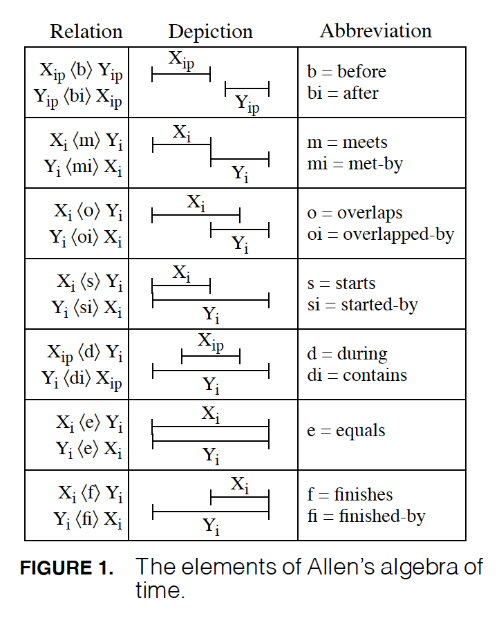

Extended Interval Algebras
==========================

This notebook builds on Allen’s Interval Algebra by extending in three
ways:

1. Points & Intervals – time points are integrated with time intervals
2. Right-Branching Time – building on 1, time can also branch to the
   right (future)
3. Left-Branching Time – again, building on 1, time can also branch from
   the left (past)

NOTE: However, left- and right-branching time algebras cannot be mixed.

References
----------

1. `“Intervals, Points, and Branching Time” by A.J.
   Reich <https://www.researchgate.net/publication/220810644_Intervals_Points_and_Branching_Time>`__
   - basis for the extensions here to Allen’s algebra
2. `Allen’s Interval
   Algebra <https://www.ics.uci.edu/~alspaugh/cls/shr/allen.html>`__ or
   `here <https://thomasalspaugh.org/pub/fnd/allen.html>`__ - summarizes
   Allen’s algebra of proper time intervals
3. `“Maintaining Knowledge about Temporal Intervals” by James F.
   Allen <https://cse.unl.edu/~choueiry/Documents/Allen-CACM1983.pdf>`__
   - Allen’s original paper (PDF)

Dependencies
------------

.. code:: ipython3

    import qualreas as qr
    import os
    
    from IPython.display import Image  # Only needed to display figures here

.. code:: ipython3

    path = os.path.join(os.getenv('PYPROJ'), 'qualreas')

1. Linear Interval and Point Algebra
------------------------------------

In Allen’s original algebra, time is linear and only applies to proper
time intervals, not time points. So, effectively, it is a Linear
Interval Algebra, which is the name used for its JSON definition file.

In [`Reich,
1994 <https://www.researchgate.net/publication/220810644_Intervals_Points_and_Branching_Time>`__],
Allen’s algebra was extended to include time points, as well as proper
intervals, to obtain a Linear Interval & Point Algebra. We’ll describe
it in this section.

The Linear Interval & Point algebra extends Allen’s algebra by adding 5
new relations, involving time points, and modifies the domains and
ranges of 4 of the original 13 relations.

.. code:: ipython3

    # Instantiate algebra and print some basic info about it
    algX = qr.Algebra(os.path.join(path, "Algebras/Extended_Linear_Interval_Algebra.json"))
    print(algX.name)
    print(algX.description)
    algX_num_elements = len(algX.elements)
    algX_elem_list = ', '.join(str(algX.elements).split("|"))
    print(f"This algebra has the following {algX_num_elements} elements:\n{algX_elem_list}")

.. parsed-literal::

    Extended_Linear_Interval_Algebra
    Extension of Allen's algebra to include points and intervals
    This algebra has the following 18 elements:
    B, BI, D, DI, E, F, FI, M, MI, O, OI, PE, PF, PFI, PS, PSI, S, SI

Figure 1, below, from `Reich
1994 <https://www.researchgate.net/publication/220810644_Intervals_Points_and_Branching_Time>`__,
shows the domain and range modifications to the original 13 relations.
The subscripts on the temporal entities, X and Y, indicate that they can
be proper intervals (“i”) or points (“p”) or both (“ip”). Where the
subscript is “i” alone for both domain and range (X & Y) the original
relations are unchanged.

.. code:: ipython3

    Image(filename='../docs/_static/Extension_of_Allens_Interval_Relations.png', width="400")

The 5 additional relations needed to integrate Points with Intervals are
shown in Figure 2, below. The meaning of the subscripts remains the same
as above.

.. code:: ipython3

    Image(filename='../docs/_static/Point_Interval_Relations.png', width="400") 

.. image:: output_13_0.png
   :width: 400px

.. code:: ipython3

    algX.summary()

.. parsed-literal::

      Algebra Name: Extended_Linear_Interval_Algebra
       Description: Extension of Allen's algebra to include points and intervals
     Equality Rels: E|PE
         Relations:
                NAME (SYMBOL)         CONVERSE (ABBREV)  REFLEXIVE  SYMMETRIC TRANSITIVE   DOMAIN        RANGE
                 Before (  B)               After ( BI)    False      False       True    Pt|PInt       Pt|PInt
                  After ( BI)              Before (  B)    False      False       True    Pt|PInt       Pt|PInt
                 During (  D)            Contains ( DI)    False      False       True    Pt|PInt          PInt
               Contains ( DI)              During (  D)    False      False       True       PInt       Pt|PInt
                 Equals (  E)              Equals (  E)     True       True       True       PInt          PInt
               Finishes (  F)         Finished-by ( FI)    False      False       True       PInt          PInt
            Finished-by ( FI)            Finishes (  F)    False      False       True       PInt          PInt
                  Meets (  M)              Met-By ( MI)    False      False      False       PInt          PInt
                 Met-By ( MI)               Meets (  M)    False      False      False       PInt          PInt
               Overlaps (  O)       Overlapped-By ( OI)    False      False      False       PInt          PInt
          Overlapped-By ( OI)            Overlaps (  O)    False      False      False       PInt          PInt
           Point-Equals ( PE)        Point-Equals ( PE)     True       True       True         Pt            Pt
         Point-Finishes ( PF)   Point-Finished-By (PFI)    False      False      False         Pt          PInt
      Point-Finished-By (PFI)      Point-Finishes ( PF)    False      False      False       PInt            Pt
           Point-Starts ( PS)    Point-Started-By (PSI)    False      False      False         Pt          PInt
       Point-Started-By (PSI)        Point-Starts ( PS)    False      False      False       PInt            Pt
                 Starts (  S)          Started-By ( SI)    False      False       True       PInt          PInt
             Started-By ( SI)              Starts (  S)    False      False       True       PInt          PInt
    
    Domain & Range Abbreviations:
       Pt = Point
     PInt = Proper Interval

Equality Relations
~~~~~~~~~~~~~~~~~~

The number and type of equality relations in an algebra depends on the
number and type of entities (e.g., ‘Point’, ‘ProperInterval’) related by
relations in the algebra.

The Extended Linear Interval Algebra supports both ProperIntervals and
Points.

.. code:: ipython3

    print(f"\n{algX.name}")
    print(f"Set of all equality relations: {algX.all_equality_relations}")
    for eq_rel in algX.all_equality_relations:
        print(50*"-")
        algX.element_summary(eq_rel)
    print(50*"-")

.. parsed-literal::

    
    Extended_Linear_Interval_Algebra
    Set of all equality relations: E|PE
    --------------------------------------------------
                      Symbol: E
                        Name: Equals
                      Domain: ['ProperInterval']
                       Range: ['ProperInterval']
                    Converse: Equals
               Is Reflexive?: True
               Is Symmetric?: True
              Is Transitive?: True
    Is an Equality Relation?: True
    --------------------------------------------------
                      Symbol: PE
                        Name: Point-Equals
                      Domain: ['Point']
                       Range: ['Point']
                    Converse: Point-Equals
               Is Reflexive?: True
               Is Symmetric?: True
              Is Transitive?: True
    Is an Equality Relation?: True
    --------------------------------------------------

Check Composition Identity
~~~~~~~~~~~~~~~~~~~~~~~~~~

If :math:`r` and :math:`s` are two relations, then
:math:`!(r;s) = (!s);(!r)`

.. raw:: html

   

The check_composition_identity Algebra method checks every possible
pairing of individual algebra relations wrt the composition identity,
and returns True if all pairs check out.

.. raw:: html

   

.. code:: ipython3

    print(f"There are {algX_num_elements**2} ({algX_num_elements}x{algX_num_elements}) possible compositions.")
    algX.check_composition_identity(verbose=True)

.. parsed-literal::

    There are 324 (18x18) possible compositions.
    
    Extended_Linear_Interval_Algebra -- Composition Identity Check:
    PASSED . 324 products tested.

.. parsed-literal::

    True

Check Associativity
~~~~~~~~~~~~~~~~~~~

The is_associative Algebra method checks all possible triples of
individual algebra relations and, if the domains and ranges are
“compatible”, checks to see if the triple is associative. Incompatible
triples are skipped. It returns True if all compatible triples are
associative.

.. code:: ipython3

    print(f"\n{algX.name}:")
    print(f"There are {algX_num_elements}^3 = {algX_num_elements**3} ways we can combine the algebra's elements to test associativity.\n")
    algX.is_associative()

.. parsed-literal::

    
    Extended_Linear_Interval_Algebra:
    There are 18^3 = 5832 ways we can combine the algebra's elements to test associativity.
    
    TEST SUMMARY: 3609 OK, 2223 Skipped, 0 Failed (5832 Total)

.. parsed-literal::

    True

2. Right-Branching Interval and Point Algebra
---------------------------------------------

In [`Reich,
1994 <https://www.researchgate.net/publication/220810644_Intervals_Points_and_Branching_Time>`__],
the Linear Interval and Point Algebra described above was further
extended to support Branching Time. Both Right-Branching Time and
Left-Branching Time are possible, but not both together at the same
time.

Figure 9 from [`Reich,
1994 <https://www.researchgate.net/publication/220810644_Intervals_Points_and_Branching_Time>`__]
depicts the 6 new relations required to support Right-Branching Time, in
addition to the 18 described above.

.. code:: ipython3

    # Instantiate algebra and print some basic info about it
    algR = qr.Algebra(os.path.join(path, "Algebras/Right_Branching_Interval_Algebra.json"))
    print(algR.name)
    print(algR.description)
    algR_num_elements = len(algR.elements)
    algR_elem_list = ', '.join(str(algR.elements).split("|"))
    print(f"This algebra has the following {algR_num_elements} elements:\n{algR_elem_list}")

.. parsed-literal::

    Right_Branching_Interval_Algebra
    Reich's right-branching extension to Allen's time interval algebra (see TIME-94 paper)
    This algebra has the following 24 elements:
    B, BI, D, DI, E, F, FI, M, MI, O, OI, PE, PF, PFI, PS, PSI, RB, RBI, RO, ROI, RS, R~, S, SI

.. code:: ipython3

    Image(filename='../docs/_static/Right_Branching_Time_Relations.png', width="400")

.. image:: output_27_0.png
   :width: 400px

.. code:: ipython3

    algR.summary()

.. parsed-literal::

      Algebra Name: Right_Branching_Interval_Algebra
       Description: Reich's right-branching extension to Allen's time interval algebra (see TIME-94 paper)
     Equality Rels: E|PE
         Relations:
                NAME (SYMBOL)         CONVERSE (ABBREV)  REFLEXIVE  SYMMETRIC TRANSITIVE   DOMAIN        RANGE
                 Before (  B)               After ( BI)    False      False       True    Pt|PInt       Pt|PInt
                  After ( BI)              Before (  B)    False      False       True    Pt|PInt       Pt|PInt
                 During (  D)            Contains ( DI)    False      False       True    Pt|PInt          PInt
               Contains ( DI)              During (  D)    False      False       True       PInt       Pt|PInt
                 Equals (  E)              Equals (  E)     True       True       True       PInt          PInt
               Finishes (  F)         Finished-by ( FI)    False      False       True       PInt          PInt
            Finished-by ( FI)            Finishes (  F)    False      False       True       PInt          PInt
                  Meets (  M)              Met-By ( MI)    False      False      False       PInt          PInt
                 Met-By ( MI)               Meets (  M)    False      False      False       PInt          PInt
               Overlaps (  O)       Overlapped-By ( OI)    False      False      False       PInt          PInt
          Overlapped-By ( OI)            Overlaps (  O)    False      False      False       PInt          PInt
           Point-Equals ( PE)        Point-Equals ( PE)     True       True       True         Pt            Pt
         Point-Finishes ( PF)   Point-Finished-By (PFI)    False      False      False         Pt          PInt
      Point-Finished-By (PFI)      Point-Finishes ( PF)    False      False      False       PInt            Pt
           Point-Starts ( PS)    Point-Started-By (PSI)    False      False      False         Pt          PInt
       Point-Started-By (PSI)        Point-Starts ( PS)    False      False      False       PInt            Pt
           Right-Before ( RB)         Right-After (RBI)    False      False       True       PInt       Pt|PInt
            Right-After (RBI)        Right-Before ( RB)    False      False       True    Pt|PInt          PInt
         Right-Overlaps ( RO) Right-Overlapped-By (ROI)    False      False      False       PInt          PInt
    Right-Overlapped-By (ROI)      Right-Overlaps ( RO)    False      False      False       PInt          PInt
           Right-Starts ( RS)        Right-Starts ( RS)    False       True      False       PInt          PInt
     Right-Incomparable ( R~)  Right-Incomparable ( R~)    False       True      False    Pt|PInt       Pt|PInt
                 Starts (  S)          Started-By ( SI)    False      False       True       PInt          PInt
             Started-By ( SI)              Starts (  S)    False      False       True       PInt          PInt
    
    Domain & Range Abbreviations:
       Pt = Point
     PInt = Proper Interval

3. Left-Branching Interval and Point Algebra
--------------------------------------------

Figure 10 from [`Reich,
1994 <https://www.researchgate.net/publication/220810644_Intervals_Points_and_Branching_Time>`__]
depicts the 6 new relations required to support Left-Branching Time, in
addition to the 18 described, above, for the Extended Linear Interval
Algebra.

.. code:: ipython3

    # Instantiate algebra and print some basic info about it
    algL = qr.Algebra(os.path.join(path, "Algebras/Left_Branching_Interval_Algebra.json"))
    print(algL.name)
    print(algL.description)
    algL_num_elements = len(algL.elements)
    algL_elem_list = ', '.join(str(algL.elements).split("|"))
    print(f"This algebra has the following {algL_num_elements} elements:\n{algL_elem_list}")

.. parsed-literal::

    Left_Branching_Interval_Algebra
    Reich's left-branching extension to Allen's time interval algebra (see TIME-94 paper)
    This algebra has the following 24 elements:
    B, BI, D, DI, E, F, FI, LB, LBI, LF, LO, LOI, L~, M, MI, O, OI, PE, PF, PFI, PS, PSI, S, SI

.. code:: ipython3

    Image(filename='../docs/_static/Left_Branching_Time_Relations.png', width="400")

.. code:: ipython3

    algL.summary()

.. parsed-literal::

      Algebra Name: Left_Branching_Interval_Algebra
       Description: Reich's left-branching extension to Allen's time interval algebra (see TIME-94 paper)
     Equality Rels: E|PE
         Relations:
                NAME (SYMBOL)         CONVERSE (ABBREV)  REFLEXIVE  SYMMETRIC TRANSITIVE   DOMAIN        RANGE
                 Before (  B)               After ( BI)    False      False       True    Pt|PInt       Pt|PInt
                  After ( BI)              Before (  B)    False      False       True    Pt|PInt       Pt|PInt
                 During (  D)            Contains ( DI)    False      False       True    Pt|PInt          PInt
               Contains ( DI)              During (  D)    False      False       True       PInt       Pt|PInt
                 Equals (  E)              Equals (  E)     True       True       True       PInt          PInt
               Finishes (  F)         Finished-by ( FI)    False      False       True       PInt          PInt
            Finished-by ( FI)            Finishes (  F)    False      False       True       PInt          PInt
            Left-Before ( LB)          Left-After (LBI)    False      False       True    Pt|PInt          PInt
             Left-After (LBI)         Left-Before ( LB)    False      False       True       PInt       Pt|PInt
          Left-Finishes ( LF)       Left-Finishes ( LF)    False       True      False       PInt          PInt
          Left-Overlaps ( LO)  Left-Overlapped-By (LOI)    False      False      False       PInt          PInt
     Left-Overlapped-By (LOI)       Left-Overlaps ( LO)    False      False      False       PInt          PInt
      Left-Incomparable ( L~)   Left-Incomparable ( L~)    False       True      False    Pt|PInt       Pt|PInt
                  Meets (  M)              Met-By ( MI)    False      False      False       PInt          PInt
                 Met-By ( MI)               Meets (  M)    False      False      False       PInt          PInt
               Overlaps (  O)       Overlapped-By ( OI)    False      False      False       PInt          PInt
          Overlapped-By ( OI)            Overlaps (  O)    False      False      False       PInt          PInt
           Point-Equals ( PE)        Point-Equals ( PE)     True       True       True         Pt            Pt
         Point-Finishes ( PF)   Point-Finished-By (PFI)    False      False      False         Pt          PInt
      Point-Finished-By (PFI)      Point-Finishes ( PF)    False      False      False       PInt            Pt
           Point-Starts ( PS)    Point-Started-By (PSI)    False      False      False         Pt          PInt
       Point-Started-By (PSI)        Point-Starts ( PS)    False      False      False       PInt            Pt
                 Starts (  S)          Started-By ( SI)    False      False       True       PInt          PInt
             Started-By ( SI)              Starts (  S)    False      False       True       PInt          PInt
    
    Domain & Range Abbreviations:
       Pt = Point
     PInt = Proper Interval

Pick one of the three algebras to use for examples:
---------------------------------------------------

.. code:: ipython3

    alg = algR

Algebra Element Summary
-----------------------

A domain (or range) of [‘Point’, ‘ProperInterval’] means that the
Temporal Entity being related can be a ‘Point’ or a ‘ProperInterval’,
but not both at the same time.

Here are a few element summaries:

.. code:: ipython3

    from random import sample
    
    sample_size = 3
    
    for element in sample(list(alg.elements), sample_size):
        alg.element_summary(element)
        print("\n")

.. parsed-literal::

                      Symbol: E
                        Name: Equals
                      Domain: ['ProperInterval']
                       Range: ['ProperInterval']
                    Converse: Equals
               Is Reflexive?: True
               Is Symmetric?: True
              Is Transitive?: True
    Is an Equality Relation?: True
    
    
                      Symbol: R~
                        Name: Right-Incomparable
                      Domain: ['Point', 'ProperInterval']
                       Range: ['Point', 'ProperInterval']
                    Converse: Right-Incomparable
               Is Reflexive?: False
               Is Symmetric?: True
              Is Transitive?: False
    Is an Equality Relation?: False
    
    
                      Symbol: PSI
                        Name: Point-Started-By
                      Domain: ['ProperInterval']
                       Range: ['Point']
                    Converse: Point-Starts
               Is Reflexive?: False
               Is Symmetric?: False
              Is Transitive?: False
    Is an Equality Relation?: False
    
    

Equality Relations
------------------

The number and type of equality relations in an algebra depends on the
number and type of domains and ranges supported by the algebra. (e.g.,
‘Point’, ‘ProperInterval’, or both)

.. code:: ipython3

    print(f"\n{alg.description}")
    print(f"Set of all equality relations: {alg.all_equality_relations}")

.. parsed-literal::

    
    Reich's right-branching extension to Allen's time interval algebra (see TIME-94 paper)
    Set of all equality relations: E|PE

Here are element summaries of the algebra’s equality relations:

.. code:: ipython3

    for eq_rel in alg.all_equality_relations:
        print(50*"-")
        print(f"{eq_rel}:")
        alg.element_summary(eq_rel)
    print(50*"-")

.. parsed-literal::

    --------------------------------------------------
    E:
                      Symbol: E
                        Name: Equals
                      Domain: ['ProperInterval']
                       Range: ['ProperInterval']
                    Converse: Equals
               Is Reflexive?: True
               Is Symmetric?: True
              Is Transitive?: True
    Is an Equality Relation?: True
    --------------------------------------------------
    PE:
                      Symbol: PE
                        Name: Point-Equals
                      Domain: ['Point']
                       Range: ['Point']
                    Converse: Point-Equals
               Is Reflexive?: True
               Is Symmetric?: True
              Is Transitive?: True
    Is an Equality Relation?: True
    --------------------------------------------------

Creating Relation Sets
----------------------

There are two acceptable input formats for creating relation sets:

.. code:: ipython3

    relset_version1 = alg.relset("B|M|FI")
    relset_version2 = alg.relset(['B', 'FI', 'M'])
    print(relset_version1)
    print(relset_version2)
    print(f"Same? {relset_version1 == relset_version2}")

.. parsed-literal::

    B|FI|M
    B|FI|M
    Same? True

Singleton sets can also be created in two ways:

.. code:: ipython3

    singleton_relset_v1 = alg.relset("B")
    singleton_relset_v2 = alg.relset(["B"])
    print(singleton_relset_v1)
    print(singleton_relset_v2)
    print(f"Same? {singleton_relset_v1 == singleton_relset_v2}")

.. parsed-literal::

    B
    B
    Same? True

And, there are two ways the empty set can be created:

.. code:: ipython3

    empty_relset_v1 = alg.relset("")
    empty_relset_v2 = alg.relset([])
    print(empty_relset_v1)  # Nothing will printout here.
    print(empty_relset_v2)  # Nor here.
    print(f"Same? {empty_relset_v1 == empty_relset_v2}")
    
    empty_relset_v1  # Just so we can see something that looks empty...

.. parsed-literal::

    
    
    Same? True

.. parsed-literal::

    relset()

Operations on Relation Sets
---------------------------

Addition
~~~~~~~~

Addition (+) is set intersection:

.. code:: ipython3

    alg.relset('B|M|O') + alg.relset('F|O|M|S')

.. parsed-literal::

    relset(['M', 'O'])

.. code:: ipython3

    alg.relset('B|M|O') + alg.relset('F|S')

.. parsed-literal::

    relset()

Composition
~~~~~~~~~~~

Composition, sometimes referred to as “multiplication”, is relation
composition applied to sets of relations.
(https://en.wikipedia.org/wiki/Composition_of_relations)

Loosely speaking, let :math:`\rho, \sigma, \tau` be relation sets, then
:math:`\rho ; \sigma = \tau`, if, by transitivity,
:math:`(A \rho B) \wedge (B \sigma C) \Rightarrow (A \tau C)`.

The transitivity table in the algebra’s JSON definition file describes
how singleton relation sets compose with each other. When more than one
relation appears in a set, the result of composition is the union of all
pairwise compositions of the individual relations in the sets.

For example, below, we calculate (F|MI);(O|D) and then break it down
into 4 different compositions involving single relations, representing
the pairwise compositions of F|MI and O|D:

.. code:: ipython3

    rel1 = "F"
    rel2= "O"
    rel3 = "MI"
    rel4 = "D"
    print(f"({rel1}|{rel3});({rel2}|{rel4}) = {alg.compose(alg.relset('F|MI'), alg.relset('O|D'))}")

.. parsed-literal::

    (F|MI);(O|D) = D|F|O|OI|ROI|S

.. code:: ipython3

    print(f"{rel1};{rel2} = {alg.compose(alg.relset(rel1), alg.relset(rel2))}")
    print(f"{rel1};{rel4} = {alg.compose(alg.relset(rel1), alg.relset(rel4))}")
    print(f"{rel3};{rel2} = {alg.compose(alg.relset(rel3), alg.relset(rel2))}")
    print(f"{rel3};{rel4} = {alg.compose(alg.relset(rel3), alg.relset(rel4))}")

.. parsed-literal::

    F;O = D|O|S
    F;D = D
    MI;O = D|F|OI|ROI
    MI;D = D|F|OI|ROI

Not every composition of relations makes sense, and the result then is
the empty relation set.

For example…

.. code:: ipython3

    alg.compose(alg.relset("F"), alg.relset("PF"))

.. parsed-literal::

    relset()

.. code:: ipython3

    alg.element_summary("F")
    print("\n")
    alg.element_summary("PF")

.. parsed-literal::

                      Symbol: F
                        Name: Finishes
                      Domain: ['ProperInterval']
                       Range: ['ProperInterval']
                    Converse: Finished-by
               Is Reflexive?: False
               Is Symmetric?: False
              Is Transitive?: True
    Is an Equality Relation?: False
    
    
                      Symbol: PF
                        Name: Point-Finishes
                      Domain: ['Point']
                       Range: ['ProperInterval']
                    Converse: Point-Finished-By
               Is Reflexive?: False
               Is Symmetric?: False
              Is Transitive?: False
    Is an Equality Relation?: False

The relation set above is empty because the range of F has nothing in
common with the domain of PF. Their domains and ranges are shown by the
summaries below.

If we assume that A, B, and C are Temporal Entities, then the expression
(A Finishes B) implies that B is a Proper Interval, but (B
Point-Finishes C) implies that B is a Point. Since B cannot be both a
Point and a Proper Interval, the composition, F;PF, results in the empty
set.

Converses
~~~~~~~~~

NOTATION: Here, we’ll denote the converse operation with “!”. So, if
:math:`A` and :math:`B` are Temporal Entities, and :math:`r` is a
relation between them, then :math:`!r` is its converse relation, so,
:math:`A r B` if and only if :math:`B !r A`. For example, “A before B”
if and only if “B after A”.

Individual relations have converses:

.. code:: ipython3

    rel_symbol = 'B'
    print(f"The converse of {alg.rel_name(rel_symbol)} is {alg.rel_converse_name(rel_symbol)}")

.. parsed-literal::

    The converse of Before is After

And relation sets also have converses:

.. code:: ipython3

    print(f"!{alg.relset(rel_symbol)} = {alg.converse(alg.relset(rel_symbol))}")
    print(f"!({alg.converse(relset_version1)}) = {relset_version1}")

.. parsed-literal::

    !B = BI
    !(BI|F|MI) = B|FI|M

Complement of a Relation Set
~~~~~~~~~~~~~~~~~~~~~~~~~~~~

The complement of a relation set, R, is the set of all relation elements
that are not in R.

We’ll use ~R to denote the complement of R.

.. code:: ipython3

    R = alg.relset('B|BI|D|DI|E|F|FI|M|MI|O|OI')
    compR = R.complement()
    
    print(f"\nAll Elements = {alg.elements}")
    print(f"          R  = {R}")
    print(f"         ~R  =                            {compR}")
    print(f"       ~(~R) = {compR.complement()}")

.. parsed-literal::

    
    All Elements = B|BI|D|DI|E|F|FI|M|MI|O|OI|PE|PF|PFI|PS|PSI|RB|RBI|RO|ROI|RS|R~|S|SI
              R  = B|BI|D|DI|E|F|FI|M|MI|O|OI
             ~R  =                            PE|PF|PFI|PS|PSI|RB|RBI|RO|ROI|RS|R~|S|SI
           ~(~R) = B|BI|D|DI|E|F|FI|M|MI|O|OI

Global Properties of an Algebra of Relations
--------------------------------------------

There are two properties of an Algebra that are true for all
“applicable” elements in the algebra: \* The Composition Identity \*
Associativity, when domains & ranges permit

Composition Identity
~~~~~~~~~~~~~~~~~~~~

If :math:`r` and :math:`s` are two relations, then
:math:`!(r;s) = (!s);(!r)`

Here’s an example:

.. code:: ipython3

    r = alg.relset("O")
    s = alg.relset("F")
    
    conv_comp_r_s = alg.converse(alg.compose(r, s))
    print(f"!({r};{s}) = {conv_comp_r_s}")
    
    comp_conv_s_conv_r = alg.compose(alg.converse(s), alg.converse(r))
    print(f"!{s};!{r} = {comp_conv_s_conv_r}")
    
    print(f"Same? {conv_comp_r_s == comp_conv_s_conv_r}")

.. parsed-literal::

    !(O;F) = DI|OI|SI
    !F;!O = DI|OI|SI
    Same? True

The check_composition_identity Algebra method checks every possible
pairing of individual algebra relations wrt the composition identity,
and returns True if all pairs check out.

.. code:: ipython3

    algX.check_composition_identity(verbose=True)

.. parsed-literal::

    
    Extended_Linear_Interval_Algebra -- Composition Identity Check:
    PASSED . 324 products tested.

.. parsed-literal::

    True

Associativity
~~~~~~~~~~~~~

The is_associative Algebra method checks all possible triples of
individual algebra relations and, if the domains and ranges are
“compatible”, checks to see if the triple is associative. Incompatible
triples are skipped. It returns True if all compatible triples are
associative.

.. code:: ipython3

    num_elements = len(alg.elements)
    print(f"There are {num_elements}^3 = {num_elements**3} ways we can combine the algebra's elements to test associativity.")

.. parsed-literal::

    There are 24^3 = 13824 ways we can combine the algebra's elements to test associativity.

The following method tests all of those ways, skipping the ones that
don’t make sense due to range-domain mismatches.

.. code:: ipython3

    alg.is_associative()

.. parsed-literal::

    TEST SUMMARY: 9772 OK, 4052 Skipped, 0 Failed (13824 Total)

.. parsed-literal::

    True

