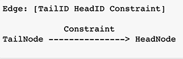
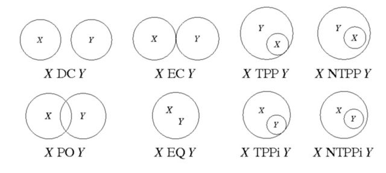
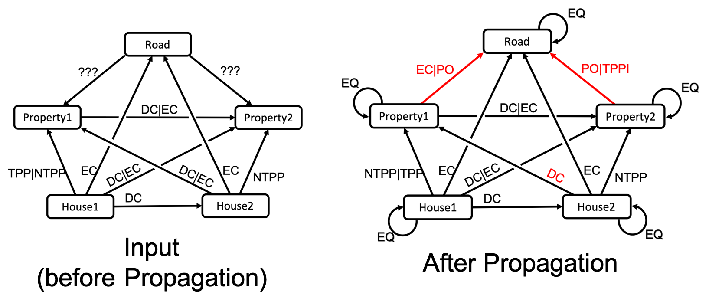

Region Connection Calculus (RCC)
================================

.. code:: ipython3

    import qualreas as qr
    import os
    from IPython.display import Image

To begin, we will instantiate a Constraint Network and it’s
corresponding Algebra from two JSON files.

Each are kept in separate directories, ‘Networks’ and ‘Algebras’, within
a top-level ‘qualreas’ directory, with the full path defined here using
an environment variable:

.. code:: ipython3

    qr_path = os.path.join(os.getenv('PYPROJ'), 'qualreas')

Once defined, an Algebra’s JSON format should remain unchanged. The name
of the Algebra used by a Network can then be stored in the Network’s
definition (in JSON) regardless of where the Network’s JSON file
resides. So, we only need provide the path to the directory containing
Algebra files:

.. code:: ipython3

    alg_dir = os.path.join(qr_path, "Algebras")

Networks, on the other hand, could be numerous and change often. So, we
need to provide the full path to the Network’s JSON file.

.. code:: ipython3

    rcc8_file = os.path.join(qr_path, "Networks", "rcc8_example.json")

Constraint Network in JSON Format 
----------------------------------

Here’s what a network looks like in JSON format.

A node is represented as a list of two things: 1. Node ID (i.e., Node
Name) 1. List of ontology classes the node belongs to (e.g.,
“ProperInterval”, “Region”)

   NOTE: Networks that are based on simple relation algebras, such as
   Allen’s Interval Algebra and the Region Connection Calculus, only
   involve relations among entities that are all from the same ontology
   class, such as Proper Time Intervals or Spatial Regions. So, the
   ontology classes of entities being related by the relations does not
   need to be considered when, for example, composing relations.
   However, when ontology classes are integrated, such as Proper Time
   Intervals and Time Points, then the ontology classes of the entities
   being related become important.

An edge is represented as a list of three things, representing a
directed edge, labeled with a constraint: 1. Tail Node ID 1. Head Node
ID 1. Constraint

See graphical depiction below:

.. code:: ipython3

    Image("Images/Edge_Notation_Meaning.png", width=300, height=100)

The network, shown in JSON format below, is the example from the
`Wikipedia page on the Region Connection Calculus
(RCC8) <https://en.wikipedia.org/wiki/Region_connection_calculus>`__.
The URL is also in the “description” field of the JSON format below. The
network, below, is depicted as a `labeled graph near the end of this
example <#rcc8_figures>`__.

.. code:: ipython3

    !cat {rcc8_file}

.. parsed-literal::

    {
        "name": "Wikipedia RCC8 Example",
        "algebra": "RCC8_Algebra",
        "abbreviations": {"dec": "DC|EC"},
        "description": "See https://en.wikipedia.org/wiki/Region_connection_calculus#Examples",
        "nodes": [
            ["House1", ["Region"]],
            ["House2", ["Region"]],
            ["Property1", ["Region"]],
            ["Property2", ["Region"]],
            ["Road", ["Region"]]
        ],
        "edges": [
            ["House1", "House2", "DC"],
            ["House1", "Property1", "TPP|NTPP"],
            ["House1", "Property2", "dec"],
            ["House1", "Road", "EC"],
            ["House2", "Property1", "dec"],
            ["House2", "Property2", "NTPP"],
            ["House2", "Road", "EC"],
            ["Property1", "Property2", "dec"],
            ["Road", "Property1"],
            ["Road", "Property2"]
        ]
    }

NOTES: 1. The Wikipedia page on RCC8 represents disjunctions of
constraints as sets, e.g., {DC, EC}, whereas qualreas represents this
with the string “DC|EC”. Constraint sets represent disjunctions of
relation statements, e.g., (Tail DC|EC Head) <==> (Tail DC Head) OR
(Tail EC Head). 1. For convenience, constraints can be abbreviated using
a dictionary of abbreviations. For example, the constraint “DC|EC”,
above, is abbreviated as “dec”. By the way, internally, the qualreas
module stores and operates on constraint sets as
`bitsets <https://bitsets.readthedocs.io/en/stable/>`__. 1. No
constraints are given for the Road-to-Property1 or Road-to-Property2
edges. The meaning then is that all RCC8 relations are possible for
those two edges. This can be seen in the first summary of the network
farther below. 1. The Network object in qualreas is a subclass of
`networkx.digraph <https://networkx.github.io/documentation/stable/reference/classes/digraph.html>`__,
which has functionality for loading/saving from/to JSON format. However,
the JSON functionality in NetworkX is not easy to read, nor is it
compact, and it is awkward to associate an Algebra with a Network using
those formats. So, the bespoke JSON format, described in this notebook,
was developed for qualreas.

RCC-8’s Spatial Relations 
~~~~~~~~~~~~~~~~~~~~~~~~~~

For convenient reference, here are the 8 spatial relations of RCC-8:

.. code:: ipython3

    Image("Images/640px-RCC8.jpg")

Attribution: CC BY-SA 3.0,
https://en.wikipedia.org/w/index.php?curid=8614172

Instantiate the Constraint Network Object 
------------------------------------------

.. code:: ipython3

    rcc8_net = qr.Network(algebra_path=alg_dir, json_file_name=rcc8_file)

The printed representation of a network provides its name and associated
algebra:

.. code:: ipython3

    print(rcc8_net)

.. parsed-literal::

    <Network--Wikipedia RCC8 Example--RCC8_Algebra>

Summarize the Network 
----------------------

Below is a summary of the Network Object just instantiated.

The format is: \* Network Name: Number of Nodes, Number of Edges \*
Algebra Name \* Tail_ID1: Class List \* => Head_ID1: Constraint1 \* =>
Head_ID2: Constraint2 \* … \* and so on …

.. code:: ipython3

    rcc8_net.summary(show_all=True)

.. parsed-literal::

    
    Wikipedia RCC8 Example: 5 nodes, 25 edges
      Algebra: RCC8_Algebra
      House1:['Region']
        => House1: EQ
        => House2: DC
        => Property1: NTPP|TPP
        => Property2: DC|EC
        => Road: EC
      House2:['Region']
        => House2: EQ
        => House1: DC
        => Property1: DC|EC
        => Property2: NTPP
        => Road: EC
      Property1:['Region']
        => Property1: EQ
        => House1: NTPPI|TPPI
        => House2: DC|EC
        => Property2: DC|EC
        => Road: DC|EC|EQ|NTPP|NTPPI|PO|TPP|TPPI
      Property2:['Region']
        => Property2: EQ
        => House1: DC|EC
        => House2: NTPPI
        => Property1: DC|EC
        => Road: DC|EC|EQ|NTPP|NTPPI|PO|TPP|TPPI
      Road:['Region']
        => Road: EQ
        => House1: EC
        => House2: EC
        => Property1: DC|EC|EQ|NTPP|NTPPI|PO|TPP|TPPI
        => Property2: DC|EC|EQ|NTPP|NTPPI|PO|TPP|TPPI

Notice that, in the network summary above, even edges between an entity
and itself are included (e.g., House1 –> House1, with constraint EQ).
The relation on such an edge will always be the equality relation(s) for
whatever ontology class(es) the entity belongs to. These edges are
included in constraint propagation so that ontology classes are properly
accounted for.

Also, the summary above shows all possible connections between nodes,
including converses, which is somewhat redundant. That is, if we know
that X r Y, then we can infer that Y converse(r) X. To see a more
compact representation that lists just one link per node pair, leave the
argument, show_all, at its default setting of False, as shown below.

.. code:: ipython3

    rcc8_net.summary()

.. parsed-literal::

    
    Wikipedia RCC8 Example: 5 nodes, 25 edges
      Algebra: RCC8_Algebra
      House1:['Region']
        => House1: EQ
        => House2: DC
        => Property1: NTPP|TPP
        => Property2: DC|EC
        => Road: EC
      House2:['Region']
        => House2: EQ
        => Property1: DC|EC
        => Property2: NTPP
        => Road: EC
      Property1:['Region']
        => Property1: EQ
        => Property2: DC|EC
        => Road: DC|EC|EQ|NTPP|NTPPI|PO|TPP|TPPI
      Property2:['Region']
        => Property2: EQ
        => Road: DC|EC|EQ|NTPP|NTPPI|PO|TPP|TPPI
      Road:['Region']
        => Road: EQ

The next two sections show how to obtain specific information about
network nodes (“entities”) and edges.

Get Entity (Network Nodes) 
~~~~~~~~~~~~~~~~~~~~~~~~~~~

get_entity returns an entity object (e.g., TemporalEntity,
SpatialEntity). Use the object’s methods to access it’s attributes.

.. code:: ipython3

    entity = rcc8_net.get_entity("House1")
    entity

.. parsed-literal::

    SpatialEntity(['Region'] 'House1')

.. code:: ipython3

    entity.name

.. parsed-literal::

    'House1'

.. code:: ipython3

    entity.classes

.. parsed-literal::

    ['Region']

Get Edge by Tail & Head Node IDs 
~~~~~~~~~~~~~~~~~~~~~~~~~~~~~~~~~

Given a Tail ID and Head ID, get_edge returns an edge in the form of a
tuple of three things, in order: (Tail Node ID, Head Node ID,
Constraint)

.. code:: ipython3

    edge = rcc8_net.get_edge("Property1", "Road")
    edge

.. parsed-literal::

    ('Property1', 'Road', 'DC|EC|EQ|NTPP|NTPPI|PO|TPP|TPPI')

get_constraint takes the same inputs, but returns only the constraint
for that edge.

.. code:: ipython3

    rcc8_net.get_constraint("Property1", "Road")

.. parsed-literal::

    'DC|EC|EQ|NTPP|NTPPI|PO|TPP|TPPI'

By the way, the Network method, set_constraint, can be used to set or
change the constraint on an edge. Setting the constraint on an edge,
[Tail, Head], will automatically, set the converse constraint on the
edge, [Head, Tail]. Always run the propogate method on a Network after
setting/changing constraints.

The Algebra “Inside” the Network 
~~~~~~~~~~~~~~~~~~~~~~~~~~~~~~~~~

WARNING: There really should be no reason for messing around with the
algebra that a network is based on. But we’ll take a look at one here,
just so we can see that it actually exists.

So, to begin, we’ll use an accessor to obtain the algebra, then we’ll
examine the algebra a bit.

.. code:: ipython3

    rcc8 = rcc8_net.algebra
    print(rcc8)

.. parsed-literal::

    <RCC8_Algebra: Region Connection Calculus 8 Algebra>

Here are all of the algebra’s elements:

.. code:: ipython3

    rcc8.elements

.. parsed-literal::

    relset(['DC', 'EC', 'EQ', 'NTPP', 'NTPPI', 'PO', 'TPP', 'TPPI'])

The print representation of relsets is more compact and convenient:

.. code:: ipython3

    print(rcc8.elements)

.. parsed-literal::

    DC|EC|EQ|NTPP|NTPPI|PO|TPP|TPPI

Here’s an example summary of an individual element:

.. code:: ipython3

    rcc8.element_summary('NTPP')

.. parsed-literal::

                      Symbol: NTPP
                        Name: NonTangentialProperPart
                      Domain: ['Region']
                       Range: ['Region']
                    Converse: NonTangentialProperPartInverse
               Is Reflexive?: False
               Is Symmetric?: False
              Is Transitive?: True
    Is an Equality Relation?: False

We can create relsets from lists of element names:

.. code:: ipython3

    rs1 = rcc8.relset(["DC", "EC"])
    rs1

.. parsed-literal::

    relset(['DC', 'EC'])

.. code:: ipython3

    rs2 = rcc8.relset(["NTPP"])
    rs2

.. parsed-literal::

    relset(['NTPP'])

Again, the relset print representation is more compact:

.. code:: ipython3

    print(f"rs1 = {rs1}")
    print(f"rs2 = {rs2}")

.. parsed-literal::

    rs1 = DC|EC
    rs2 = NTPP

Relsets can also be created from the relset print representation:

.. code:: ipython3

    rcc8.relset('DC|EC')

.. parsed-literal::

    relset(['DC', 'EC'])

.. code:: ipython3

    print(rcc8.relset('DC|EC'))

.. parsed-literal::

    DC|EC

In the literature on Relation Algebras, the semicolon (“;”) is used to
represent the composition operator (also called multiplication in many
papers). In qualreas, composition can only be performed on relsets.
Here’s an example:

.. code:: ipython3

    print(f"{rs1} ; {rs2} = {rcc8.compose(rs1, rs2)}")

.. parsed-literal::

    DC|EC ; NTPP = DC|EC|NTPP|PO|TPP

The meaning of the composition example, above, is that if S, R, and T
are spatial entities (regions) per the RCC-8 algebra, then > if [(S DC
R) or (S EC R)] >

.. raw:: html

   

and (R NTPP T)

.. raw:: html

   

..

   .. raw:: html

      

   then either (S DC T) or (S EC T) or (S NTPP T) or (S PO T) or (S TPP
   T)

   .. raw:: html

      

Now, back to Constraint Networks.

Perform Constraint Propagation 
-------------------------------

After propagation, note the change in the constraints between the Road
and the two Properties.

.. code:: ipython3

    rcc8_net.propagate()
    rcc8_net.summary()

.. parsed-literal::

    
    Wikipedia RCC8 Example: 5 nodes, 25 edges
      Algebra: RCC8_Algebra
      House1:['Region']
        => House1: EQ
        => House2: DC
        => Property1: NTPP|TPP
        => Property2: DC|EC
        => Road: EC
      House2:['Region']
        => House2: EQ
        => Property1: DC
        => Property2: NTPP
        => Road: EC
      Property1:['Region']
        => Property1: EQ
        => Property2: DC|EC
        => Road: EC|PO
      Property2:['Region']
        => Property2: EQ
        => Road: PO|TPPI
      Road:['Region']
        => Road: EQ

For easier comparison, the printout below is in a format similar to that
found on the `Wikipedia example
page <https://en.wikipedia.org/wiki/Region_connection_calculus#Examples>`__:

.. code:: ipython3

    road = "Road"
    prop1 = "Property1"
    prop2 = "Property2"
    
    print(f"{road} {rcc8_net.get_constraint(road, prop1)} {prop1}")
    print(f"{road} {rcc8_net.get_constraint(road, prop2)} {prop2}")

.. parsed-literal::

    Road EC|PO Property1
    Road PO|TPP Property2

RCC8 Example Figures 
~~~~~~~~~~~~~~~~~~~~~

The two figures below depict Wikipedia’s RCC-8 example, where the first
depicts the original input network, and the second depicts the network
following constraint propagation by qualreas. Constraints that changed
from the input after propagation are shown in red.

.. code:: ipython3

    Image("Images/wikipedia_rcc8_example.png")

Singleton Labelings of a Network 
---------------------------------

The constraints on the edges in a network can often involve multiple
relations, representing disjunctions of single constraints. If we derive
a network from that, where each constraint involves only a single
relation, it is called a Singleton Labelling. It is possible for a
singleton labeling to be inconsistent. So, it’s of great interest to
derive all possible consistent singleton labellings.

Here, we’ll compute all of the singleton labelings of the Wikipedia RCC8
example, presented above.

To begin, look again at the summary of that network:

.. code:: ipython3

    rcc8_net.summary()

.. parsed-literal::

    
    Wikipedia RCC8 Example: 5 nodes, 25 edges
      Algebra: RCC8_Algebra
      House1:['Region']
        => House1: EQ
        => House2: DC
        => Property1: NTPP|TPP
        => Property2: DC|EC
        => Road: EC
      House2:['Region']
        => House2: EQ
        => Property1: DC
        => Property2: NTPP
        => Road: EC
      Property1:['Region']
        => Property1: EQ
        => Property2: DC|EC
        => Road: EC|PO
      Property2:['Region']
        => Property2: EQ
        => Road: PO|TPPI
      Road:['Region']
        => Road: EQ

Not counting converses–which, conveniently, are not shown in the
summary, above–there are 5 links that have multiple relations (e.g.,
[House1, Property1, NTPP|TPP]). Since there are 2 relations on each of
these 5 edges, if we breakout the network into all possible singleton
labelings we have 2^5 = 32 possible networks. And it’s possible that not
all of the 32 networks will be consistent. In fact, as shown below, only
9 of the 32 possible singleton labelings are consistent.

.. code:: ipython3

    singleton_labelings = rcc8_net.all_singleton_labelings()
    consistent_singleton_labelings = rcc8_net.consistent_singleton_labelings()
    
    print(f"There are {len(singleton_labelings)} singleton labelings of Wikipedia's RCC8 example,")
    print(f"but only {len(consistent_singleton_labelings)} of them are consistent.")

.. parsed-literal::

    There are 32 singleton labelings of Wikipedia's RCC8 example,
    but only 9 of them are consistent.

Here are summaries of all 9 singleton labelings:

.. code:: ipython3

    count = 1
    for network in consistent_singleton_labelings:
        print("-------------------------")
        print(f" Singleton Labeling #{count}")
        print("-------------------------")
        network.summary()
        count += 1
        print(" ")

.. parsed-literal::

    -------------------------
     Singleton Labeling #1
    -------------------------
    
    Wikipedia RCC8 Example: 5 nodes, 25 edges
      Algebra: RCC8_Algebra
      House1:['Region']
        => House1: EQ
        => House2: DC
        => Property1: TPP
        => Property2: EC
        => Road: EC
      House2:['Region']
        => House2: EQ
        => Property1: DC
        => Property2: NTPP
        => Road: EC
      Property1:['Region']
        => Property1: EQ
        => Property2: EC
        => Road: PO
      Property2:['Region']
        => Property2: EQ
        => Road: PO
      Road:['Region']
        => Road: EQ
     
    -------------------------
     Singleton Labeling #2
    -------------------------
    
    Wikipedia RCC8 Example: 5 nodes, 25 edges
      Algebra: RCC8_Algebra
      House1:['Region']
        => House1: EQ
        => House2: DC
        => Property1: TPP
        => Property2: EC
        => Road: EC
      House2:['Region']
        => House2: EQ
        => Property1: DC
        => Property2: NTPP
        => Road: EC
      Property1:['Region']
        => Property1: EQ
        => Property2: EC
        => Road: EC
      Property2:['Region']
        => Property2: EQ
        => Road: TPPI
      Road:['Region']
        => Road: EQ
     
    -------------------------
     Singleton Labeling #3
    -------------------------
    
    Wikipedia RCC8 Example: 5 nodes, 25 edges
      Algebra: RCC8_Algebra
      House1:['Region']
        => House1: EQ
        => House2: DC
        => Property1: TPP
        => Property2: EC
        => Road: EC
      House2:['Region']
        => House2: EQ
        => Property1: DC
        => Property2: NTPP
        => Road: EC
      Property1:['Region']
        => Property1: EQ
        => Property2: EC
        => Road: EC
      Property2:['Region']
        => Property2: EQ
        => Road: PO
      Road:['Region']
        => Road: EQ
     
    -------------------------
     Singleton Labeling #4
    -------------------------
    
    Wikipedia RCC8 Example: 5 nodes, 25 edges
      Algebra: RCC8_Algebra
      House1:['Region']
        => House1: EQ
        => House2: DC
        => Property1: TPP
        => Property2: DC
        => Road: EC
      House2:['Region']
        => House2: EQ
        => Property1: DC
        => Property2: NTPP
        => Road: EC
      Property1:['Region']
        => Property1: EQ
        => Property2: EC
        => Road: PO
      Property2:['Region']
        => Property2: EQ
        => Road: PO
      Road:['Region']
        => Road: EQ
     
    -------------------------
     Singleton Labeling #5
    -------------------------
    
    Wikipedia RCC8 Example: 5 nodes, 25 edges
      Algebra: RCC8_Algebra
      House1:['Region']
        => House1: EQ
        => House2: DC
        => Property1: TPP
        => Property2: DC
        => Road: EC
      House2:['Region']
        => House2: EQ
        => Property1: DC
        => Property2: NTPP
        => Road: EC
      Property1:['Region']
        => Property1: EQ
        => Property2: EC
        => Road: EC
      Property2:['Region']
        => Property2: EQ
        => Road: PO
      Road:['Region']
        => Road: EQ
     
    -------------------------
     Singleton Labeling #6
    -------------------------
    
    Wikipedia RCC8 Example: 5 nodes, 25 edges
      Algebra: RCC8_Algebra
      House1:['Region']
        => House1: EQ
        => House2: DC
        => Property1: TPP
        => Property2: DC
        => Road: EC
      House2:['Region']
        => House2: EQ
        => Property1: DC
        => Property2: NTPP
        => Road: EC
      Property1:['Region']
        => Property1: EQ
        => Property2: DC
        => Road: PO
      Property2:['Region']
        => Property2: EQ
        => Road: PO
      Road:['Region']
        => Road: EQ
     
    -------------------------
     Singleton Labeling #7
    -------------------------
    
    Wikipedia RCC8 Example: 5 nodes, 25 edges
      Algebra: RCC8_Algebra
      House1:['Region']
        => House1: EQ
        => House2: DC
        => Property1: TPP
        => Property2: DC
        => Road: EC
      House2:['Region']
        => House2: EQ
        => Property1: DC
        => Property2: NTPP
        => Road: EC
      Property1:['Region']
        => Property1: EQ
        => Property2: DC
        => Road: EC
      Property2:['Region']
        => Property2: EQ
        => Road: PO
      Road:['Region']
        => Road: EQ
     
    -------------------------
     Singleton Labeling #8
    -------------------------
    
    Wikipedia RCC8 Example: 5 nodes, 25 edges
      Algebra: RCC8_Algebra
      House1:['Region']
        => House1: EQ
        => House2: DC
        => Property1: NTPP
        => Property2: DC
        => Road: EC
      House2:['Region']
        => House2: EQ
        => Property1: DC
        => Property2: NTPP
        => Road: EC
      Property1:['Region']
        => Property1: EQ
        => Property2: EC
        => Road: PO
      Property2:['Region']
        => Property2: EQ
        => Road: PO
      Road:['Region']
        => Road: EQ
     
    -------------------------
     Singleton Labeling #9
    -------------------------
    
    Wikipedia RCC8 Example: 5 nodes, 25 edges
      Algebra: RCC8_Algebra
      House1:['Region']
        => House1: EQ
        => House2: DC
        => Property1: NTPP
        => Property2: DC
        => Road: EC
      House2:['Region']
        => House2: EQ
        => Property1: DC
        => Property2: NTPP
        => Road: EC
      Property1:['Region']
        => Property1: EQ
        => Property2: DC
        => Road: PO
      Property2:['Region']
        => Property2: EQ
        => Road: PO
      Road:['Region']
        => Road: EQ
     

Converting Networks to/from Other Formats 
------------------------------------------

In this section, we show how to convert Networks to/from JSON or Python
dictionary formats.

Network to Dictionary 
~~~~~~~~~~~~~~~~~~~~~~

Note: The only differences between JSON and the dictionary output by
to_dict are the single quotes instead of double quotes required by JSON.

.. code:: ipython3

    rcc8_net_dict = rcc8_net.to_dict()
    
    rcc8_net_dict

.. parsed-literal::

    {'name': 'Wikipedia RCC8 Example',
     'algebra': 'RCC8_Algebra',
     'description': 'See https://en.wikipedia.org/wiki/Region_connection_calculus#Examples',
     'nodes': [['House1', ['Region']],
      ['House2', ['Region']],
      ['Property1', ['Region']],
      ['Property2', ['Region']],
      ['Road', ['Region']]],
     'edges': [['House1', 'House2', 'DC'],
      ['House1', 'Property1', 'NTPP|TPP'],
      ['House1', 'Property2', 'DC|EC'],
      ['House1', 'Road', 'EC'],
      ['House2', 'Property1', 'DC'],
      ['House2', 'Property2', 'NTPP'],
      ['House2', 'Road', 'EC'],
      ['Property1', 'Property2', 'DC|EC'],
      ['Property1', 'Road', 'EC|PO'],
      ['Property2', 'Road', 'PO|TPPI']]}

Dictionary to Network 
~~~~~~~~~~~~~~~~~~~~~~

Instantiating a Network from a dictionary is similar to using the JSON
format. Although it is not shown below, we can define and use
abbreviations for constraints, and we can leave the constraints off of
edge definitions to indicate that all relations are possible.

.. code:: ipython3

    rcc8_net_from_dict = qr.Network(algebra_path=alg_dir, network_dict=rcc8_net_dict)
    
    print(rcc8_net_from_dict)
    
    rcc8_net_from_dict.summary(show_all=False)

.. parsed-literal::

    <Network--Wikipedia RCC8 Example--RCC8_Algebra>
    
    Wikipedia RCC8 Example: 5 nodes, 25 edges
      Algebra: RCC8_Algebra
      House1:['Region']
        => House1: EQ
        => House2: DC
        => Property1: NTPP|TPP
        => Property2: DC|EC
        => Road: EC
      House2:['Region']
        => House2: EQ
        => Property1: DC
        => Property2: NTPP
        => Road: EC
      Property1:['Region']
        => Property1: EQ
        => Property2: DC|EC
        => Road: EC|PO
      Property2:['Region']
        => Property2: EQ
        => Road: PO|TPPI
      Road:['Region']
        => Road: EQ

Network to JSON 
~~~~~~~~~~~~~~~~

A simple way to serialize a network in JSON format is to first convert
it to a dictionary using to_dict and then use json.dump() or
json.dumps() to write it out to a file or convert it to a string,
respectively.

However, either way, the resulting file or string are not pretty
printed.

Network to JSON File 
^^^^^^^^^^^^^^^^^^^^^

.. code:: ipython3

    import json
    
    rcc8_json_file = os.path.join(qr_path, "Networks", "rcc8_test1.json")
    
    with open(rcc8_json_file, "w") as fout:
        json.dump(rcc8_net_dict, fout)

.. code:: ipython3

    !cat {rcc8_json_file}

.. parsed-literal::

    {"name": "Wikipedia RCC8 Example", "algebra": "RCC8_Algebra", "description": "See https://en.wikipedia.org/wiki/Region_connection_calculus#Examples", "nodes": [["House1", ["Region"]], ["House2", ["Region"]], ["Property1", ["Region"]], ["Property2", ["Region"]], ["Road", ["Region"]]], "edges": [["House1", "House2", "DC"], ["House1", "Property1", "NTPP|TPP"], ["House1", "Property2", "DC|EC"], ["House1", "Road", "EC"], ["House2", "Property1", "DC"], ["House2", "Property2", "NTPP"], ["House2", "Road", "EC"], ["Property1", "Property2", "DC|EC"], ["Property1", "Road", "EC|PO"], ["Property2", "Road", "PO|TPPI"]]}

Network to JSON String 
^^^^^^^^^^^^^^^^^^^^^^^

.. code:: ipython3

    json.dumps(rcc8_net_dict)

.. parsed-literal::

    '{"name": "Wikipedia RCC8 Example", "algebra": "RCC8_Algebra", "description": "See https://en.wikipedia.org/wiki/Region_connection_calculus#Examples", "nodes": [["House1", ["Region"]], ["House2", ["Region"]], ["Property1", ["Region"]], ["Property2", ["Region"]], ["Road", ["Region"]]], "edges": [["House1", "House2", "DC"], ["House1", "Property1", "NTPP|TPP"], ["House1", "Property2", "DC|EC"], ["House1", "Road", "EC"], ["House2", "Property1", "DC"], ["House2", "Property2", "NTPP"], ["House2", "Road", "EC"], ["Property1", "Property2", "DC|EC"], ["Property1", "Road", "EC|PO"], ["Property2", "Road", "PO|TPPI"]]}'

